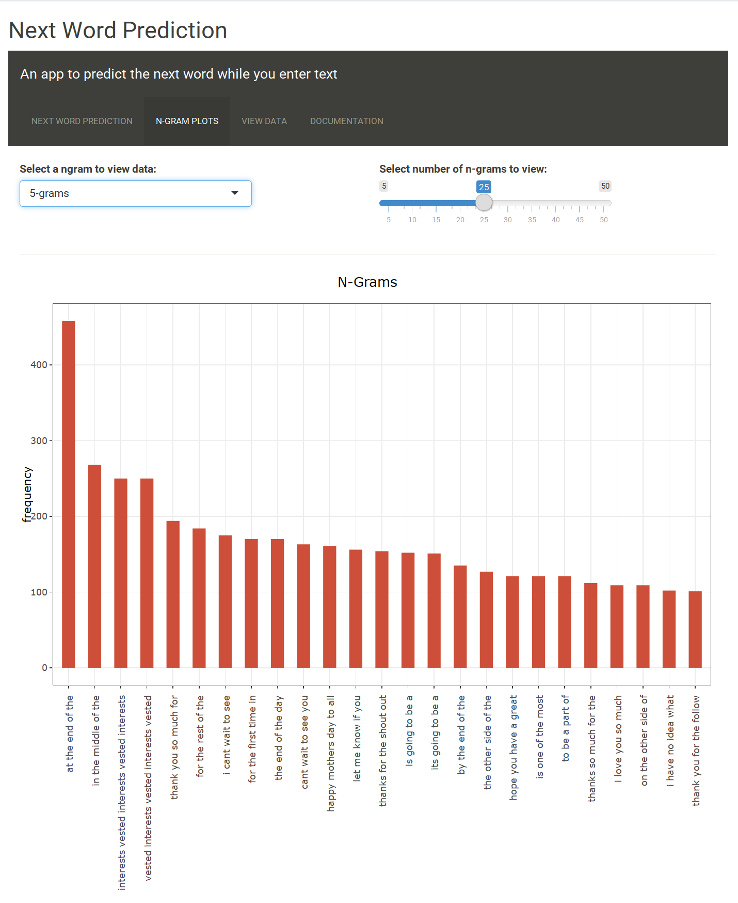
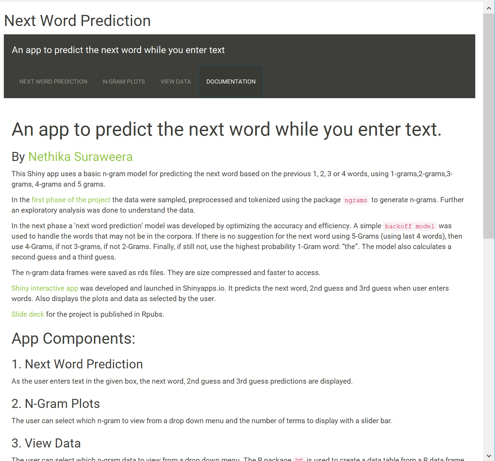

# An app to predict the next word while you enter text.

### By [Nethika Suraweera](https://www.linkedin.com/in/nethika/)

This Shiny app uses a basic n-gram model for predicting the next word based on the previous 1, 2, 3 or 4 words, using 1-grams, 2-grams, 3-grams, 4-grams and 5 grams.
 
In the [first phase of the project](https://rpubs.com/nethika/milestone_report) the data were sampled, preprocessed and tokenized using the package `ngrams` to generate n-grams. Further an exploratory analysis was done to understand the data.

In the next phase a 'next word prediction' model was developed by optimizing the accuracy and efficiency. A simple `backoff model` was used to handle the words that may not be in the corpora. If there is no suggestion for the next word using 5-Grams (using last 4 words), then use 4-Grams, if not 3-grams, if not 2-Grams. Finally, if still not, use the highest probability  1-Gram word: "the". The model also calculates a second guess and a third guess.

The n-gram data frames were saved as rds files. They are size compressed and faster to access. 

[Shiny interactive app](https://nethika.shinyapps.io/Shiney_App_Next_Word/) was developed and launched in Shinyapps.io. It predicts the next word, 2nd guess and 3rd guess when user enters words. Also displays the plots and data as selected by the user.

[Slide deck](http://rpubs.com/nethika/predict_next_word)  for the project is published in Rpubs.

## Snapshots from the App

  
  
  
  

 

## App Components:

### 1. Next Word Prediction

As the user enters text in the given box, the next word, 2nd guess and 3rd guess predictions are displayed.

### 2. N-Gram Plots

The user can select which n-gram to view from a drop down menu and the number of terms to display with a slider bar.

### 3. View Data 

The user can select which n-gram data to view from a drop down menu. The R package `DT` is used to create a data table from a R data frame. 

## Packages used:

- shiny
- tm
- ngram
- stringr
- reshape
- stylo
- plotly
- ggplot2
- dplyr
- DT

## Data:

The data are from 3 different sources: 1. Blogs, 2. Twitter 3. News. Only the English data was used in this project.

Data Downloaded from: [Capstone Dataset](https://d396qusza40orc.cloudfront.net/dsscapstone/dataset/Coursera-SwiftKey.zip)

### Sampling Data:
Initially 5% of data is being randomly sampled to represent the larger data set. As the project evolved, to achieve a good accuracy-speed balance, the sample size was expanded. 

### Data Preprocessing 

- Removing URLs
- Removing Hash tags
- Removing Twitter handlers
- Removing non Ascii characters
- Convert to lower case
- Removing Profanity words (Used 451 words/phrases from the Full List of Bad Words and Top Swear Words Banned by Google.)
- Removing punctuation
- Removing numbers
- Removing/fixing white spaces

